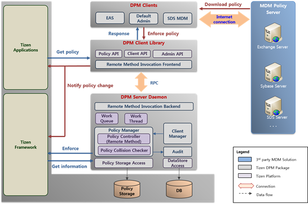

# Device Policy Management


The Device Policy Management (DPM) framework supports enterprise applications by providing IT administrators means to create security-aware applications. They are useful in situations where IT administrators require rich control over employee devices.

DPM consists of a device policy client library and a device policy manager. The device policy manager manages all device policies and provides interfaces for the device policy client library. The device policy client library contains the device administration functions the client application can call. Internally, the device policy client library communicates with the device policy manager using a built-in remote method invocation engine.

The main features of the [Tizen.Security.DevicePolicyManager](#https://samsung.github.io/TizenFX/master/api/Tizen.Security.DevicePolicyManager.html) namespace include:

- Managing policies

  You can [track the state between the device admin client and the device policy manager](#client_application) with the `DevicePolicyManager` class provided by the [Tizen.Security.DevicePolicyManager](#https://samsung.github.io/TizenFX/master/api/Tizen.Security.DevicePolicyManager.html) namespace.


- Checking restrictions

  You can [check the restriction states of the device](#client_application), such as camera, microphone, Wi-Fi, Bluetooth, and USB, using the properties of the each policy classes provided by the [Tizen.Security.DevicePolicyManager](#https://samsung.github.io/TizenFX/master/api/Tizen.Security.DevicePolicyManager.html) namespace.

The following figure illustrates the DPM framework process.

**Figure: DPM framework process**



## Prerequisites

To use the methods and properties of the [Tizen.Security.DevicePolicyManager](#https://samsung.github.io/TizenFX/master/api/Tizen.Security.DevicePolicyManager.html) namesapce, include in your application:

```
using Tizen.Security.DevicePolicyManager;
```

<a name="client_application"></a>
## Managing Device Policies

To manage device policies:

1. Create a DevicePolicyManager instance:

   ```
   try
   {
       DevicePolicyManager dpm = new DevicePolicyManager();
   ```

2. Get the Policy instance using `getPolicy<T>()` method of the DevicePolicyManager instance:
   ```
       MediaPolicy mediaPolicy = dpm.getPolicy<MediaPolicy>();
   ```
   > **Note**
   > the DevicePolicyManager instance must exists when using the Policy instance.

3. Register a event handler for managing policies to the Policy instance:

   ```
       /// Register the event handler
       mediaPolicy.CameraPolicyChanged += onCameraPolicyChanged;
   }
   catch (Exception e)
   {
       /// Handle exception
   }

   /// Create the event handler
   void onCameraPolicyChanged(Object Sender, PolicyChangedEventArgs args)
   {
       Console.WriteLine("PolicyName: " + args.PolicyName + ", Current policy state: " + args.IsAllowed);
   }
   ```

4. Check the device restriction state:

   ```
   /// Check the restriction state of the camera
   /// false: using the camera is not allowed
   /// true: using the camera is allowed
   bool cameraPolicyState = mediaPolicy.IsCameraAllowed;
   ```

5. When no longer needed, destroy the Policy instance and DPM instance:

   ```
   mediaPolicy.Dispose();
   dpm.Dispose();
   ```
   > **Note**
   > The policy instance must be destroyed first.

## Related Information
- Dependencies
  - Tizen 5.5 and Higher for Mobile
  - Tizen 5.5 and Higher for Wearable
